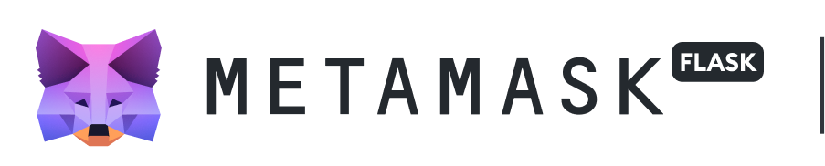
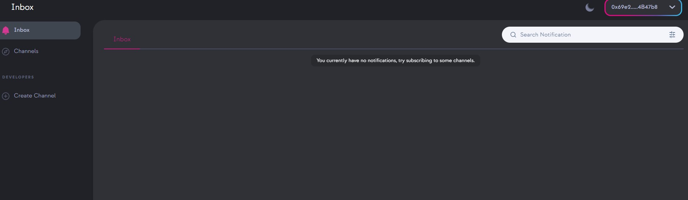
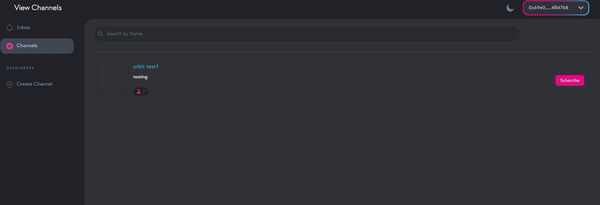
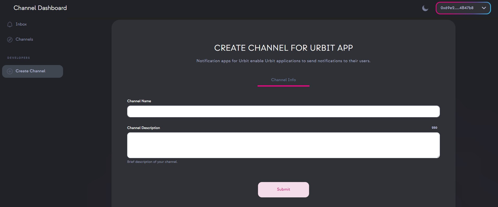

# URBIT NOTIFY

## The Urbit notify app enables users to receive notifications from various apps within the Urbit network <br>

<p align="center">

</p> <br>

## Summary

<p>The Urbit notify app is a tool that allows users of the Urbit network to receive notifications from various apps without having to actively access or be logged into their "ship," which is the individual node or identity within the Urbit network.This allows users to stay informed of any important updates or events happening within the apps they use on the Urbit network, and they can respond to those notifications</p>
<p>
This app works by routing notifications from different apps on the Urbit network to a user's ship and relaying them through the notify app. This enables users to receive updates and alerts even when they're not actively using their ship or the apps in question.
</p>
<p>
One of the key features of this app is its ability to integrate with other apps, enabling users to receive notifications from a variety of sources in a single place. Currently, it is integrated with MetaMask, a popular Ethereum wallet, using a feature called "snaps".
</p>
<p>
Overall, The Urbit Notify app is an useful utility that brings the much needed convenience and security to users by allowing them to receive and interact with notifications from different apps in the Urbit network without accessing their ship, also allowing them to intergate with any other apps for receiving notifications.
</p>

# Documentation

<p>With the Urbit notify app, users can receive updates and alerts from different apps on the Urbit network, even when they're not actively using their shipor the apps in question. The app is also versatile and can integrate with other apps, enabling users to receive notifications from a variety of sources in a single place. Currently, it is integrated with MetaMask, a popular Ethereum wallet, using a feature called "snaps."</p>

## For Frontend Users

Users need Metamask flask to run sanps.MetaMask Flask is a distribution of the software designed for developers. It's like a laboratory (hence the name) where the MetaMask team can try out new ideas and features. <br>
For running `URBIT SNAP` user to install this flask build: [Metamask Flask](https://vault.elephantdrive.com/web_access/shares/v2/links/redeem_share.aspx#/AAAAAAAAAACtX30fww3OcQ/1)


Step 1: **User need to install metmask flask build from the above link. In order to receive notifications in metamak from urbit notify app.**
<br>

step 2: **After installing meatamask falsk user need to access urbit notify app and login with your metamask wallet**

<br>

step 3: **After login users will redirected to the dashboard. where user can see differnt tabs `inbox,channel,create channels`**
<br>

- inbox : users can view notifications from different apps in the urbit network.
   <br>
- channel : user need to subscribe a channel to receive notifications. suppose a user need to receive notifications from `notify app` channel regarding the new updates of notify app user need to subscribe to this channel. <br>
   <br>
- create channel : If a dapp needs to send notifications to users, it must create a channel in the 'notify app'. create channel tab allow users to create channel. <br>
   <br>

## For Developers

The backend of the Urbit notify app is built by making changes to the existing chat app from the Urbit tutorials. The app currently retrieves notifications using the user's wallet address. There is a mapping set up between each user's`Urbit ID` and their corresponding `wallet address`, which facilitates the retrieval of notifications for the correct user. frontend of the app is developed using reactjs.<br>

<p>Metamask Snaps that have been installed will operate in a sandboxed environment and have access to metmask via api requests. Various requests require access permissions, which are granted during snap installation. </p>

[metamask docs](https://docs.metamask.io/guide/snaps.html#execution-environment)

Understanding the snap lifespan is crucial. Snaps are made to awaken in reaction to rpc calls and events. A snap will be terminated if MetaMask notices that it has become unresponsive or idle.

- A snap is considered "unresponsive" if:

  - It has not received a JSON-RPC request for 30 seconds.
  - It takes more than 60 seconds to process a JSON-RPC request.

  ## Snap Manifest file

In order to get Metamask to execute snap, a valid `snap.manifest.json` file is rquired. located in `packages\snap\`

```json
{
  "version": "0.1.0",
  "description": " Urbit Snap allow users to receive notification in metamask",
  "proposedName": "URBIT SNAP",
  "repository": {
    "type": "git",
    "url": "https://github.com/bytes1/urbit.git"
  },
  "source": {
    "shasum": "JKeEDSd3GhJ/3PHTaJJ+1sQIVDOv9Uz5npqeFmSU85M=",
    "location": {
      "npm": {
        "filePath": "dist/bundle.js",
        "iconPath": "images/icon.svg",
        "packageName": "urbitlearnnotify",
        "registry": "https://registry.npmjs.org/"
      }
    }
  },
  "initialPermissions": {
    "snap_confirm": {},
    "endowment:network-access": {},
    "snap_notify": {},
    "eth_accounts": {},
    "endowment:long-running": {},
    "snap_manageState": {},
    "endowment:cronjob": {
      "jobs": [
        {
          "expression": "* * * * *",
          "request": {
            "method": "check",
            "params": ["cronjob_param"]
          }
        }
      ]
    }
  },
  "manifestVersion": "0.1"
}
```

<br>
Manifest file holds importanat information about snap like hash ,initial permission,source location etc.

## permissions

we need permission in order to access different things in metamask. if a snap need to access eth_accounts it should mention in the manifest file. I am not explaning about all permissions in our mainfest file. You can vist [metamask docs](https://docs.metamask.io/guide/snaps-development-guide.html#permissions)

**`endowment:cronjob`** <br>

To display notifications in the metamask, we must periodically check for notifications using snap. Snaps are made to awaken in reaction to rpc calls and events. for perodic runnning of snap we are using cronojob.Cronjob feature will add new possibility to periodically run specific Snap RPC methods. Cronjob feature is implemented as a new permission with caveats that are used to specify job methods, parameters and schedule using CRON syntax.

```json
"endowment:cronjob": {
      "jobs": [
        {
          "expression": "* * * * *",
          "request": {
            "method": "check",
            "params": ["cronjob_param"]
          }
        }
      ]
    }
```

Supported format

```
*    *    *    *    *    *
┬    ┬    ┬    ┬    ┬    ┬
│    │    │    │    │    |
│    │    │    │    │    └ day of week (0 - 7, 1L - 7L) (0 or 7 is Sun)
│    │    │    │    └───── month (1 - 12)
│    │    │    └────────── day of month (1 - 31, L)
│    │    └─────────────── hour (0 - 23)
│    └──────────────────── minute (0 - 59)
└───────────────────────── second (0 - 59, optional)
```

in our urbit snap it will check for new notification in every minutues. cronjob will send an RPC request to invoke `check` method to fetch the request.For more details of `CRONJOB` vist this [website](https://crontab.guru/every-2-minutes)

**`snap_manageState`**

`snap_manageState` is only Callable by snaps that are used presist some data to the disk and retrive it at will. The data is automatically encrypted using a snap-specific key and automatically decrypted when retrieved. In our snap it is used to store received notifications.
